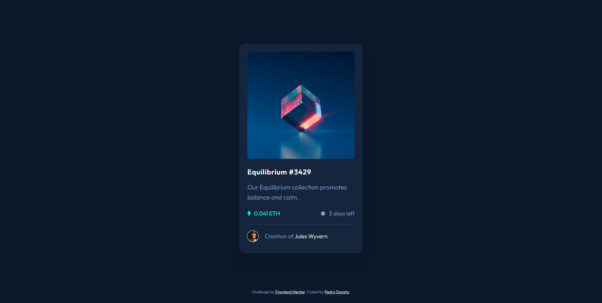

# Frontend Mentor - NFT preview card component solution

This is a solution to the [NFT preview card component challenge on Frontend Mentor](https://www.frontendmentor.io/challenges/nft-preview-card-component-SbdUL_w0U). 

## Table of contents

- [Overview](#overview)
  - [The challenge](#the-challenge)
  - [Screenshot](#screenshot)
  - [Links](#links)
- [My process](#my-process)
  - [Built with](#built-with)
  - [What I learned](#what-i-learned)
  - [Continued development](#continued-development)
  - [Useful resources](#useful-resources)
- [Author](#author)

## Overview

This is a NFT preview card component, usually users find it on nft markets.

### The challenge

Users should be able to:

- View the optimal layout depending on their device's screen size
- See hover states for interactive elements

### Screenshot

### Links

- Solution URL: [Solution](https://www.frontendmentor.io/solutions/responsive-nft-preview-card-component-with-html-and-css-flexbox-NUuH3fYb8g)
- Live Site URL: [Live](https://pedrodcn.github.io/frontendmentor-solutions/nftpreview/)

## My process

### Built with

- Semantic HTML5 markup
- CSS custom properties
- Flexbox
- Mobile-first workflow

### What I learned

It's really hard to try to be pixel perfect with the layout just looking at
the design image, especially the spacing, so I tried to make it as readable as possible
maintaining a logical way of defining the spacing of elements, using a consistent
gap size to the flex containers.

### Continued development

Need to find a more efficient way to set elements to appear on hover, with
different properties (e.g. different opacities) without adding complexity to
the layout, like nesting the elements inside divs just for styling, or having
to use `:before` and `:after` all the time just for that.

### Useful resources

- [Outfit Font](https://fonts.google.com/specimen/Outfit)

## Author

- Frontend Mentor - [@PedroDCN](https://www.frontendmentor.io/profile/PedroDCN)
