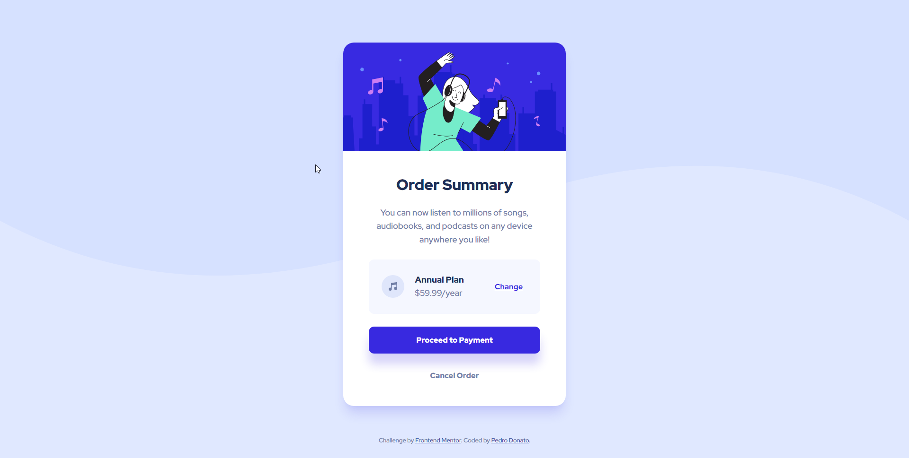

# Frontend Mentor - Order summary card solution

This is a solution to the [Order summary card challenge on Frontend Mentor](https://www.frontendmentor.io/challenges/order-summary-component-QlPmajDUj).

## Table of contents

- [Overview](#overview)
  - [The challenge](#the-challenge)
  - [Screenshot](#screenshot)
  - [Links](#links)
- [My process](#my-process)
  - [Built with](#built-with)
  - [What I learned](#what-i-learned)
  - [Continued development](#continued-development)
  - [Useful resources](#useful-resources)
- [Author](#author)

## Overview

This is an order summary card component, usually encountered when making a purchase of a product or renewing a subscription.

### The challenge

Users should be able to:

- See hover states for interactive elements

### Screenshot

### Links

- Solution URL: [Solution](https://www.frontendmentor.io/solutions/order-summary-component-using-html-and-css-flexbox-LyY-k1KFPa)
- Live Site URL: [Live](https://pedrodcn.github.io/frontendmentor-solutions/ordersummary/)

## My process

### Built with

- Semantic HTML5 markup
- CSS custom properties
- Flexbox
- Mobile-first workflow

### What I learned

I'm still practicing using BEM naming convention, and this was a good project to try using it by my own, without help.
Still a little confused about how I should name buttons that are supposed to look like links but aren't,
and if the way I styled my different types of buttons using modifiers was correct, or if there is a better way, maybe I'll try and redo this project, but with a different approach, like using CUBE CSS methodology, where
an exception (element modifier) would be specified as a data attribute rather than another class.

This was a good exercise to practice defining the position and flow of elements using flexbox,
where I learned to use `flex: auto` and `flex: none` properties.

### Continued development

I'm still not comfortable with the way I'm applying BEM, need more time researching and studying a better way of naming,
and maybe find a good balance of BEM and utility classes.

### Useful resources

- [layered box-shadows](https://tobiasahlin.com/blog/layered-smooth-box-shadows/)
- [Red Hat Display font](https://fonts.google.com/specimen/Red+Hat+Display)

## Author

- Frontend Mentor - [@PedroDCN](https://www.frontendmentor.io/profile/PedroDCN)
