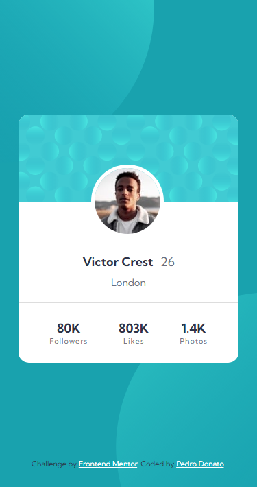
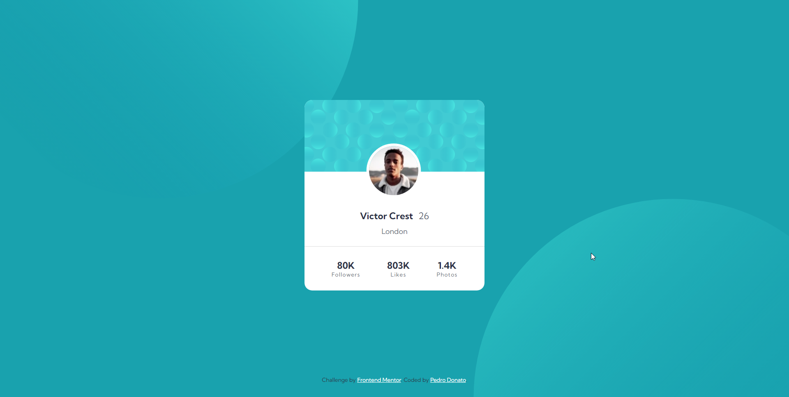

# Frontend Mentor - Profile card component solution

This is a solution to the [Profile card component challenge on Frontend Mentor](https://www.frontendmentor.io/challenges/profile-card-component-cfArpWshJ).

## Table of contents

- [Overview](#overview)
    - [The challenge](#the-challenge)
    - [Screenshot](#screenshot)
    - [Links](#links)
- [My process](#my-process)
    - [Built with](#built-with)
    - [What I learned](#what-i-learned)
    - [Continued development](#continued-development)
    - [Useful resources](#useful-resources)
- [Author](#author)

## Overview

This is a profile card component, usually found when the user is viewing their or other users' information.

### The challenge

- Build out the project to the designs provided

### Screenshot

### Links

- Solution URL: [Solution](https://www.frontendmentor.io/solutions/responsive-profile-card-using-html-and-css-flexbox-UtAEMEuuq3)
- Live Site URL: [Live](https://pedrodcn.github.io/frontendmentor-solutions/profilecard/)

## My process

### Built with

- Semantic HTML5 markup
- CSS custom properties
- Flexbox
- Mobile-first workflow

### What I learned

An easy challenge, the hardest part was thinking about how I should center the profile image to align with the background,
I decided to translate it up by half its size, so that it was aligned with the image while maintaining the document layout.

### Continued development

Need to find a better way to manage the placement of multiple background images.

### Useful resources

- [Kumbh Sans Font](https://fonts.google.com/specimen/Kumbh+Sans)

## Author

- Frontend Mentor - [@PedroDCN](https://www.frontendmentor.io/profile/PedroDCN)
