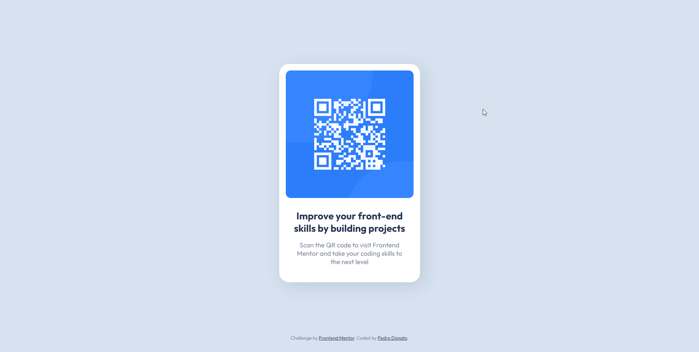

# Frontend Mentor - QR code component solution

This is a solution to the [QR code component challenge on Frontend Mentor](https://www.frontendmentor.io/challenges/qr-code-component-iux_sIO_H). 

## Table of contents

- [Overview](#overview)
  - [Screenshot](#screenshot)
  - [Links](#links)
- [My process](#my-process)
  - [Built with](#built-with)
  - [Useful resources](#useful-resources)
- [Author](#author)

## Overview

This is a QR Code component, useful for sharing a link or content via an image.

### Screenshot

### Links

- Solution URL: [Solution](https://www.frontendmentor.io/solutions/responsive-qr-code-component-using-html-and-css-flexbox-KvQE29uL6P)
- Live Site URL: [Live](https://pedrodcn.github.io/frontendmentor-solutions/qrcode/)

## My process

### Built with

- Semantic HTML5 markup
- CSS custom properties
- Flexbox
- Mobile-first workflow

### Useful resources

- [Outfit Font](https://fonts.google.com/specimen/Outfit)

## Author

- Frontend Mentor - [@PedroDCN](https://www.frontendmentor.io/profile/PedroDCN)
